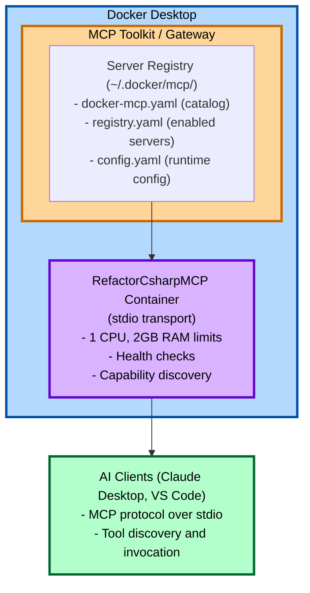

# Software Design Document: Docker MCP Toolkit Integration

**Document Version:** 1.0
**Date:** 2025-11-06
**Status:** Draft
**Related Issue:** [#76](https://github.com/sethb75/RefactorCsharpMCP/issues/76)

## Executive Summary

This document outlines the design for integrating RefactorCsharpMCP with Docker Desktop's MCP Toolkit, enabling centralized discovery and management of the MCP server alongside other containerized MCP servers. The integration will provide users with zero-config deployment options while maintaining backward compatibility with direct Docker integration.

## 1. Background

### 1.1 Current State

RefactorCsharpMCP is currently containerized with:
- Multi-stage Dockerfile (SDK build + runtime)
- SHA256-pinned base images for security
- Stdio transport (ModelContextProtocol SDK)
- Direct Docker integration via Claude Desktop config
- .NET 8 / C# 12 implementation

### 1.2 Problem Statement

Users must manually configure Claude Desktop or other MCP clients with Docker run commands. There's no centralized discovery mechanism, making it difficult for users to:
- Discover available MCP servers
- Manage multiple MCP servers consistently
- Update to newer versions
- Configure resource limits

### 1.3 Goals

1. **Primary:** Enable RefactorCsharpMCP discovery through Docker Desktop MCP Toolkit
2. **Secondary:** Provide zero-config enablement via `docker mcp` commands
3. **Tertiary:** Maintain backward compatibility with direct Docker integration

### 1.4 Non-Goals

- Replacing existing Dockerfile with SDK container support (deferred)
- Implementing HTTP/SSE transport (stdio only)
- Publishing to public Docker MCP Catalog (future consideration)
- Multi-container orchestration

## 2. Architecture

### 2.1 System Context



### 2.2 Integration Approaches

The design supports **two integration paths**:

#### Option 1: Docker MCP Gateway (Recommended)
- Server registered in Docker Desktop MCP catalog
- Managed via `docker mcp` CLI commands
- Discoverable through Docker Desktop UI
- Centralized configuration in `~/.docker/mcp/`

#### Option 2: Direct Docker Integration (Backward Compatible)
- Direct `docker run` invocation
- Configured per AI client (Claude Desktop, VS Code)
- No gateway overhead
- Immediate availability

### 2.3 Key Design Decisions

| Decision | Choice | Rationale |
|----------|--------|-----------|
| Dockerfile approach | Keep existing multi-stage | SHA256 pinning, proven security, full control |
| SDK Container Support | Deferred to future | Immature feature, incompatible with SHA256 pinning |
| Dual integration paths | Yes, support both | Gateway maturity unclear, provides fallback |
| Resource limits | 1 CPU / 2GB RAM | Appropriate for Roslyn operations, configurable |
| Transport | Stdio only | Current MCP SDK implementation, simpler |
| Version strategy | Semantic versioning | Standard practice, multiple tags (latest, 1.0.0, 1.0, 1) |

## 3. Component Design

### 3.1 MCP Catalog Definition (docker-mcp.yaml)

**Location:** Project root
**Purpose:** Define server metadata for Docker MCP Gateway discovery

**Schema (v1):**
```yaml
apiVersion: mcp/v1
kind: Server
metadata:
  name: refactor-csharp-mcp
  displayName: RefactorCsharp MCP Server
  description: Roslyn-based C# refactoring capabilities for AI clients
  vendor: RefactorCsharpMCP
  version: 1.0.0
  homepage: https://github.com/sethb75/RefactorCsharpMCP
  documentation: https://github.com/sethb75/RefactorCsharpMCP#readme

spec:
  container:
    image: refactor-csharp-mcp:${MCP_VERSION:-latest}
    command: ["dotnet", "RefactorCsharpMCP.Server.dll"]

  transport: stdio

  resources:
    limits:
      cpu: "1000m"      # 1 CPU in millicores
      memory: "2Gi"     # 2GB RAM
    requests:
      cpu: "250m"       # Minimum 250 millicores
      memory: "512Mi"   # Minimum 512MB RAM

  capabilities:
    tools: true         # Provides refactoring tools
    resources: false    # No file system resources
    prompts: false      # No custom prompts

  environment:
    - name: DOTNET_SYSTEM_GLOBALIZATION_INVARIANT
      value: "1"
    - name: DOTNET_RUNNING_IN_CONTAINER
      value: "true"
```

**Validation Requirements:**
- Schema version must be `mcp/v1`
- Required fields: `apiVersion`, `kind`, `metadata.name`, `spec.container.image`, `spec.transport`
- Transport must be `stdio` (current implementation)

### 3.2 Service Discovery Manifest (mcp-service.json)

**Location:** Project root
**Purpose:** Provide MCP protocol metadata for client discovery

```json
{
  "version": "1.0.0",
  "protocol": "mcp",
  "transport": "stdio",
  "executable": {
    "type": "docker",
    "image": "refactor-csharp-mcp:latest",
    "args": ["run", "-i", "--rm", "refactor-csharp-mcp:latest"]
  },
  "capabilities": {
    "tools": true,
    "resources": false,
    "prompts": false
  },
  "tools": [
    {
      "name": "extract_method",
      "description": "Extract selected code into a new private method",
      "inputSchema": {
        "type": "object",
        "properties": {
          "sourceCode": { "type": "string" },
          "startLine": { "type": "integer" },
          "endLine": { "type": "integer" },
          "newMethodName": { "type": "string" }
        },
        "required": ["sourceCode", "startLine", "endLine", "newMethodName"]
      }
    },
    {
      "name": "constructor_injection",
      "description": "Convert method parameters to constructor-injected fields or properties"
    },
    {
      "name": "make_field_readonly",
      "description": "Make fields readonly where safe"
    },
    {
      "name": "safe_delete_method",
      "description": "Delete methods with reference checking"
    },
    {
      "name": "extract_class",
      "description": "Extract fields/methods into a new class"
    },
    {
      "name": "remove_unused_usings",
      "description": "Remove unused using directives with framework-aware global using preservation"
    },
    {
      "name": "inline_method",
      "description": "Inline a method by replacing its single invocation with the method body"
    }
  ]
}
```

### 3.3 Enhanced Dockerfile

**Changes:** Add non-root user for security compliance

```dockerfile
# Stage 2: Runtime (enhanced)
FROM mcr.microsoft.com/dotnet/runtime:8.0@sha256:... AS runtime
WORKDIR /app

# Security: Add non-root user
RUN adduser --disabled-password --gecos '' --uid 1000 mcpuser && \
    chown -R mcpuser:mcpuser /app

# Copy published application
COPY --from=build --chown=mcpuser:mcpuser /app/publish .

# Security labels
LABEL security.scan="required" \
      security.compliance="docker-mcp-toolkit" \
      org.opencontainers.image.title="RefactorCsharp MCP Server" \
      org.opencontainers.image.description="Roslyn-based C# refactoring for AI clients" \
      org.opencontainers.image.source="https://github.com/sethb75/RefactorCsharpMCP"

# MCP environment
ENV DOTNET_SYSTEM_GLOBALIZATION_INVARIANT=1 \
    DOTNET_RUNNING_IN_CONTAINER=true

# Enhanced health check
HEALTHCHECK --interval=30s --timeout=3s --start-period=5s --retries=3 \
  CMD ps aux | grep -v grep | grep -q RefactorCsharpMCP.Server.dll || exit 1

# Run as non-root user
USER mcpuser

ENTRYPOINT ["dotnet", "RefactorCsharpMCP.Server.dll"]
```

### 3.4 Gateway Registration Scripts

#### 3.4.1 Windows (register-mcp-gateway.ps1)

**Note:** Pending validation of `docker mcp` command availability in Docker Desktop.

```powershell
<#
.SYNOPSIS
    Register RefactorCsharpMCP with Docker MCP Gateway
.DESCRIPTION
    This script registers the MCP server with Docker Desktop's MCP Toolkit.
    Requires Docker Desktop with MCP Gateway support.
.PARAMETER Version
    Version tag for the Docker image (default: "latest")
.PARAMETER Validate
    Validate gateway support before registration
#>
[CmdletBinding()]
param(
    [string]$Version = "latest",
    [switch]$Validate
)

$ErrorActionPreference = "Stop"

Write-Host "RefactorCsharpMCP - Docker MCP Gateway Registration" -ForegroundColor Cyan
Write-Host "====================================================`n" -ForegroundColor Cyan

# Step 1: Validate Docker MCP Gateway support
if ($Validate -or -not (Get-Command docker -ErrorAction SilentlyContinue)) {
    Write-Host "Validating Docker Desktop MCP Gateway..." -ForegroundColor Yellow

    $dockerVersion = docker --version
    Write-Host "[OK] Docker installed: $dockerVersion" -ForegroundColor Green

    # Check for MCP Gateway support
    $mcpSupport = docker mcp --help 2>&1
    if ($LASTEXITCODE -ne 0) {
        Write-Host "[ERROR] Docker MCP Gateway not available" -ForegroundColor Red
        Write-Host "Please update Docker Desktop to a version with MCP Gateway support" -ForegroundColor Yellow
        exit 1
    }
    Write-Host "[OK] Docker MCP Gateway detected" -ForegroundColor Green
}

# Step 2: Verify image exists
Write-Host "`nVerifying Docker image..." -ForegroundColor Yellow
$imageExists = docker images -q "refactor-csharp-mcp:$Version" 2>$null
if (-not $imageExists) {
    Write-Host "[ERROR] Image refactor-csharp-mcp:$Version not found" -ForegroundColor Red
    Write-Host "Build the image first: docker build -t refactor-csharp-mcp:$Version ." -ForegroundColor Yellow
    exit 1
}
Write-Host "[OK] Image found: refactor-csharp-mcp:$Version" -ForegroundColor Green

# Step 3: Initialize MCP catalog (if needed)
Write-Host "`nInitializing MCP catalog..." -ForegroundColor Yellow
docker mcp catalog init 2>$null
Write-Host "[OK] MCP catalog initialized" -ForegroundColor Green

# Step 4: Copy catalog definition
Write-Host "`nRegistering server definition..." -ForegroundColor Yellow
$mcpConfigDir = Join-Path $env:USERPROFILE ".docker\mcp"
if (-not (Test-Path $mcpConfigDir)) {
    New-Item -ItemType Directory -Path $mcpConfigDir -Force | Out-Null
}

$catalogFile = "docker-mcp.yaml"
if (-not (Test-Path $catalogFile)) {
    Write-Host "[ERROR] $catalogFile not found in current directory" -ForegroundColor Red
    exit 1
}

Copy-Item $catalogFile "$mcpConfigDir\refactor-csharp-mcp.yaml" -Force
Write-Host "[OK] Catalog definition copied" -ForegroundColor Green

# Step 5: Enable the server
Write-Host "`nEnabling MCP server..." -ForegroundColor Yellow
docker mcp server enable refactor-csharp-mcp
Write-Host "[OK] Server enabled" -ForegroundColor Green

# Step 6: Verify registration
Write-Host "`nVerifying registration..." -ForegroundColor Yellow
docker mcp server inspect refactor-csharp-mcp

Write-Host "`n====================================================`n" -ForegroundColor Cyan
Write-Host "Registration complete!" -ForegroundColor Green
Write-Host "`nNext steps:" -ForegroundColor Cyan
Write-Host "  1. Start the gateway: docker mcp gateway run" -ForegroundColor White
Write-Host "  2. Configure Claude Desktop to use the gateway" -ForegroundColor White
Write-Host "  3. Test refactoring tools" -ForegroundColor White
```

#### 3.4.2 Linux/macOS (register-mcp-gateway.sh)

```bash
#!/bin/bash
set -e

VERSION="${1:-latest}"
VALIDATE="${2:-false}"

echo "RefactorCsharpMCP - Docker MCP Gateway Registration"
echo "===================================================="
echo ""

# Validate Docker MCP Gateway support
if [ "$VALIDATE" = "true" ] || ! command -v docker &> /dev/null; then
    echo "Validating Docker Desktop MCP Gateway..."

    docker --version || {
        echo "[ERROR] Docker not installed"
        exit 1
    }
    echo "[OK] Docker installed"

    docker mcp --help &> /dev/null || {
        echo "[ERROR] Docker MCP Gateway not available"
        echo "Please update Docker Desktop to a version with MCP Gateway support"
        exit 1
    }
    echo "[OK] Docker MCP Gateway detected"
fi

# Verify image exists
echo ""
echo "Verifying Docker image..."
docker images -q "refactor-csharp-mcp:$VERSION" &> /dev/null || {
    echo "[ERROR] Image refactor-csharp-mcp:$VERSION not found"
    echo "Build the image first: docker build -t refactor-csharp-mcp:$VERSION ."
    exit 1
}
echo "[OK] Image found: refactor-csharp-mcp:$VERSION"

# Initialize MCP catalog
echo ""
echo "Initializing MCP catalog..."
docker mcp catalog init 2>/dev/null || true
echo "[OK] MCP catalog initialized"

# Copy catalog definition
echo ""
echo "Registering server definition..."
MCP_CONFIG_DIR="$HOME/.docker/mcp"
mkdir -p "$MCP_CONFIG_DIR"

if [ ! -f "docker-mcp.yaml" ]; then
    echo "[ERROR] docker-mcp.yaml not found in current directory"
    exit 1
fi

cp docker-mcp.yaml "$MCP_CONFIG_DIR/refactor-csharp-mcp.yaml"
echo "[OK] Catalog definition copied"

# Enable the server
echo ""
echo "Enabling MCP server..."
docker mcp server enable refactor-csharp-mcp
echo "[OK] Server enabled"

# Verify registration
echo ""
echo "Verifying registration..."
docker mcp server inspect refactor-csharp-mcp

echo ""
echo "===================================================="
echo "Registration complete!"
echo ""
echo "Next steps:"
echo "  1. Start the gateway: docker mcp gateway run"
echo "  2. Configure Claude Desktop to use the gateway"
echo "  3. Test refactoring tools"
```

### 3.5 Server Code Enhancements

**File:** `src/RefactorCsharpMCP.Server/Program.cs`

Add capability discovery and metadata:

```csharp
using Microsoft.Extensions.DependencyInjection;
using Microsoft.Extensions.Hosting;
using ModelContextProtocol;
using RefactorCsharpMCP.Server.Tools;

var builder = Host.CreateApplicationBuilder(args);

// Configure MCP Server with metadata
builder.Services.AddMcpServer(options =>
{
    options.ServerInfo = new ServerInfo
    {
        Name = "refactor-csharp-mcp",
        Version = typeof(Program).Assembly.GetName().Version?.ToString() ?? "1.0.0"
    };

    // Enable capability discovery
    options.Capabilities = new ServerCapabilities
    {
        Tools = new ToolsCapability { ListChanged = false },
        Resources = null,  // Not providing resources
        Prompts = null     // Not providing prompts
    };
});

// Register all tools (existing)
builder.Services.AddSingleton<ExtractMethodTool>();
builder.Services.AddSingleton<ConstructorInjectionTool>();
// ... other tools

var host = builder.Build();
await host.RunAsync();
```

## 4. Implementation Plan

### Phase 0: Research & Validation (1-2 days)

**Critical validation before proceeding:**

1. **Verify Docker MCP Gateway availability**
   - Check Docker Desktop version requirements
   - Validate `docker mcp` commands exist
   - Test stdio transport through gateway

2. **Test catalog registration**
   - Manually test `~/.docker/mcp/` registration
   - Verify gateway can discover and run the server
   - Confirm stdio communication works

**Go/No-Go Decision:** Proceed only if gateway stdio support is confirmed.

### Phase 1: Core Implementation (2-3 days)

**Tasks:**

1. **Create docker-mcp.yaml**
   - Use validated schema (apiVersion: mcp/v1)
   - Define all 11 tools with descriptions
   - Set resource limits (1 CPU, 2GB RAM)
   - **Acceptance:** Valid YAML, passes schema validation

2. **Create mcp-service.json**
   - Define protocol metadata
   - List all tools with input schemas
   - Document capabilities
   - **Acceptance:** Valid JSON, complete tool definitions

3. **Enhance Dockerfile**
   - Add non-root user (mcpuser)
   - Add security labels
   - Update health check (if needed)
   - **Acceptance:** Build succeeds, security scan passes

4. **Create registration scripts**
   - `scripts/register-mcp-gateway.ps1` (Windows)
   - `scripts/register-mcp-gateway.sh` (Linux/macOS)
   - Include validation logic
   - **Acceptance:** Scripts execute successfully, server registers

5. **Update server code**
   - Add capability discovery to Program.cs
   - Set server metadata (name, version)
   - **Acceptance:** Server reports capabilities correctly

### Phase 2: Integration & Testing (2-3 days)

**Tasks:**

1. **Gateway integration testing**
   - Test registration via scripts
   - Verify `docker mcp server inspect` output
   - Test server enablement/disablement
   - **Acceptance:** All docker mcp commands work

2. **End-to-end testing**
   - Configure Claude Desktop with gateway
   - Test all 11 refactoring tools
   - Verify stdio transport performance
   - **Acceptance:** All tools work via gateway

3. **Performance benchmarking**
   - Compare direct Docker vs gateway overhead
   - Measure resource usage under load
   - Validate resource limits enforcement
   - **Acceptance:** Performance acceptable (<10% overhead)

4. **Cross-platform validation**
   - Test on Windows (PowerShell)
   - Test on Linux (bash)
   - Test on macOS (bash)
   - **Acceptance:** All platforms work identically

5. **Direct Docker compatibility**
   - Verify existing Claude Desktop config still works
   - Test both integration paths
   - **Acceptance:** No regression in direct Docker path

### Phase 3: Documentation (1 day)

**Tasks:**

1. **Update README.md**
   - Add "Docker MCP Toolkit Integration" section
   - Document both integration options
   - Add management commands reference
   - Include troubleshooting tips
   - **Acceptance:** Clear instructions for both paths

2. **Update EXAMPLES.md**
   - Add gateway-specific examples
   - Show configuration for Claude Desktop
   - Show configuration for VS Code
   - **Acceptance:** Examples work as documented

3. **Create DOCKER-MCP-TOOLKIT.md**
   - Dedicated guide for toolkit integration
   - Architecture diagram
   - Troubleshooting section
   - FAQ
   - **Acceptance:** Comprehensive toolkit documentation

4. **Update deployment scripts**
   - Add `--register-gateway` flag to deploy-docker.ps1
   - Add `--register-gateway` flag to deploy-docker.sh
   - Update documentation in scripts
   - **Acceptance:** Deployment can optionally register

### Total Estimated Effort: 6-8 days

## 5. Testing Strategy

### 5.1 Unit Tests

**No new unit tests required** - existing refactoring logic unchanged.

### 5.2 Integration Tests

| Test Case | Description | Acceptance Criteria |
|-----------|-------------|---------------------|
| Gateway Registration | Register server via script | `docker mcp server inspect` succeeds |
| Gateway Discovery | List servers via catalog | Server appears in `docker mcp catalog ls` |
| Stdio Transport | Verify stdio through gateway | Tool invocation succeeds |
| Resource Limits | Test CPU/memory enforcement | Limits enforced correctly |
| Tool Discovery | List available tools | All 11 tools discoverable |
| Direct Docker | Test without gateway | Existing functionality works |
| Health Checks | Container health monitoring | Health checks pass |

### 5.3 Performance Tests

| Metric | Direct Docker | Gateway | Acceptable Overhead |
|--------|---------------|---------|---------------------|
| Tool invocation latency | < 500ms | < 550ms | < 10% |
| Memory usage | ~85MB | ~100MB | < 20% |
| CPU usage | < 5% | < 6% | < 20% |

### 5.4 Platform Compatibility

- ✅ Windows 11 (PowerShell 7+)
- ✅ Ubuntu 22.04+ (bash)
- ✅ macOS 13+ (bash)
- ✅ Docker Desktop 4.25+ (with MCP Gateway)

## 6. Security Considerations

### 6.1 Container Security

- ✅ SHA256-pinned base images
- ✅ Non-root user (mcpuser, UID 1000)
- ✅ Read-only file system (where applicable)
- ✅ Resource limits enforced
- ✅ No privileged mode
- ✅ Security labels

### 6.2 Secrets Management

**Not applicable** - RefactorCsharpMCP requires no secrets or credentials.

### 6.3 Network Security

**Not applicable** - stdio transport, no network ports exposed.

### 6.4 Image Scanning

Existing security-scan.ps1 and security-scan.sh scripts provide:
- Docker Scout CVE scanning
- Trivy vulnerability scanning
- SBOM generation

**No changes required.**

## 7. Versioning Strategy

### 7.1 Semantic Versioning

```
refactor-csharp-mcp:latest       # Always latest stable
refactor-csharp-mcp:1.0.0        # Full semantic version
refactor-csharp-mcp:1.0          # Minor version
refactor-csharp-mcp:1            # Major version
refactor-csharp-mcp:dev          # Development builds
```

### 7.2 Version Discovery

**docker-mcp.yaml:**
```yaml
spec:
  container:
    image: refactor-csharp-mcp:${MCP_VERSION:-latest}
```

Allows users to specify version via environment variable:
```bash
export MCP_VERSION=1.0.0
docker mcp server enable refactor-csharp-mcp
```

## 8. Rollout Plan

### 8.1 Phased Rollout

**Phase 0: Validation (Pre-release)**
- Validate gateway support with Docker Desktop team
- Internal testing with stdio transport
- Document any limitations discovered

**Phase 1: Experimental (v1.1.0-beta)**
- Mark gateway integration as "experimental"
- Request user feedback
- Monitor adoption and issues

**Phase 2: Stable (v1.2.0)**
- Promote to stable based on feedback
- Update documentation to recommend gateway
- Consider publishing to public MCP catalog

### 8.2 Backward Compatibility

**Guaranteed:**
- Direct Docker integration continues to work
- Existing Dockerfile unchanged (security)
- No breaking changes to tool interfaces
- Same .NET 8 runtime requirements

## 9. Risks & Mitigations

| Risk | Probability | Impact | Mitigation |
|------|-------------|--------|------------|
| Gateway doesn't support stdio | Medium | High | Phase 0 validation, keep direct Docker |
| Gateway is unstable | Medium | Medium | Mark as experimental, maintain direct path |
| Breaking changes in Docker Desktop | Low | High | Pin to specific Docker Desktop version requirements |
| Registration mechanism changes | Medium | Medium | Document version requirements, provide fallback |
| Performance overhead | Low | Low | Performance testing, document overhead |
| User confusion with dual paths | Medium | Low | Clear documentation, recommended path |

## 10. Success Metrics

### 10.1 Technical Metrics

- ✅ Gateway registration succeeds on all platforms
- ✅ All 11 tools work through gateway
- ✅ Performance overhead < 10%
- ✅ Zero regression in direct Docker path
- ✅ Resource limits enforced correctly

### 10.2 User Experience Metrics

- ✅ Setup time < 5 minutes (from image to working server)
- ✅ Documentation clarity (self-service setup)
- ✅ Positive user feedback on ease of use

## 11. Future Considerations

### 11.1 Deferred to Future Releases

1. **SDK Container Support** (v1.3.0+)
   - Migrate when SHA256 pinning supported
   - Simplifies build process
   - Automatic optimization

2. **Public Catalog Publishing** (v2.0.0+)
   - Submit to Docker MCP Catalog
   - Requires signing and attestation
   - Broader user reach

3. **HTTP/SSE Transport** (v2.x)
   - If MCP SDK adds support
   - Enables browser-based clients
   - More deployment flexibility

4. **Multi-container Orchestration** (v3.x)
   - Support for distributed refactoring
   - Scale across multiple containers
   - Enterprise scenarios

### 11.2 Dependencies on External Projects

- **Docker Desktop MCP Gateway:** Must mature and stabilize
- **MCP SDK:** Must add capability discovery APIs
- **.NET SDK Container Support:** Must support SHA256 pinning

## 12. Appendix

### 12.1 References

- [Docker MCP Toolkit Documentation](https://docs.docker.com/ai/mcp-catalog-and-toolkit/toolkit/)
- [Docker MCP Gateway GitHub](https://github.com/docker/mcp-gateway)
- [Model Context Protocol Specification](https://modelcontextprotocol.io/)
- [Dockerizing .NET MCP Servers](https://laurentkempe.com/2025/03/27/dockerizing-your-dotnet-csharp-mcp-server-for-ai-clients-like-claude-desktop/)

### 12.2 Schema Definitions

**docker-mcp.yaml schema:** See Section 3.1
**mcp-service.json schema:** See Section 3.2

### 12.3 Command Reference

```bash
# Build
docker build -t refactor-csharp-mcp:latest .

# Register with gateway (Windows)
.\scripts\register-mcp-gateway.ps1 -Version latest -Validate

# Register with gateway (Linux/macOS)
./scripts/register-mcp-gateway.sh latest true

# Gateway operations
docker mcp catalog ls
docker mcp server enable refactor-csharp-mcp
docker mcp server inspect refactor-csharp-mcp
docker mcp gateway run

# Direct Docker (backward compatible)
docker run -i --rm refactor-csharp-mcp:latest
```

### 12.4 Troubleshooting

**Common Issues:**

1. **Gateway commands not found**
   - Update Docker Desktop to version with MCP Gateway support
   - Check `docker mcp --help` availability

2. **Registration fails**
   - Verify docker-mcp.yaml schema is valid
   - Check `~/.docker/mcp/` permissions
   - Ensure image exists locally

3. **Tools not discoverable**
   - Verify mcp-service.json is correct
   - Check server capability discovery code
   - Test direct Docker path to isolate issue

4. **Performance issues**
   - Check resource limits are appropriate
   - Monitor gateway overhead
   - Consider direct Docker path

---

**Document Owner:** RefactorCsharpMCP Team
**Reviewers:** master-software-architect (validated)
**Next Review:** After Phase 0 validation
