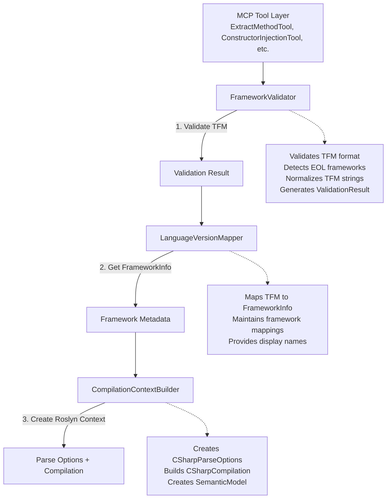
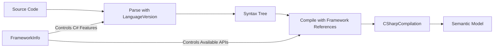
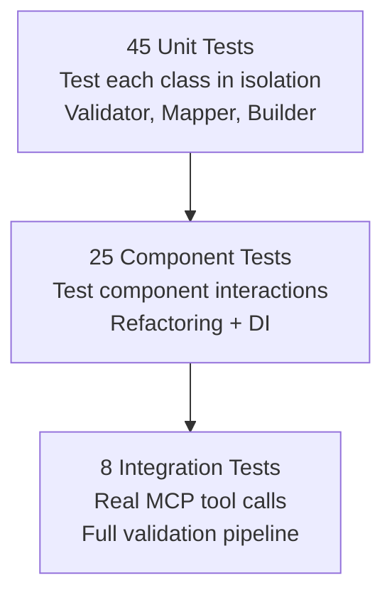
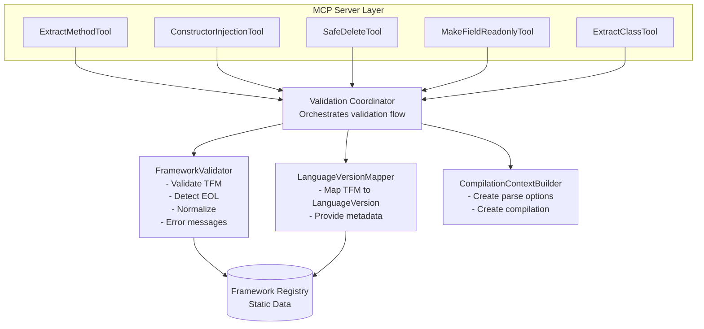
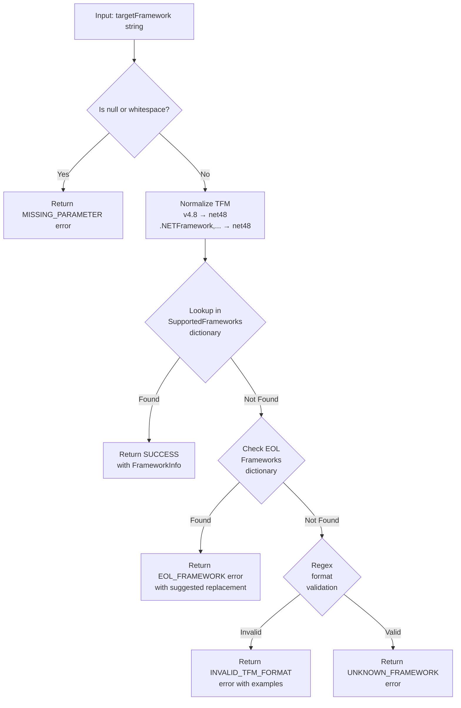
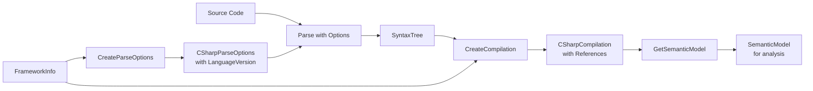

# Software Design Document: .NET Framework Version Awareness for RefactorCsharpMCP

## Document Control

| Property | Value |
|----------|-------|
| **Version** | 2.0.0 |
| **Status** | Draft for Review |
| **Created** | 2025-10-05 |
| **Author** | Seth (with Claude Code architectural guidance) |
| **Related PRD** | [PRD-Framework-Version-Awareness.md](PRD-Framework-Version-Awareness.md) |

---

## Table of Contents

1. [Executive Summary](#1-executive-summary)
2. [Architectural Decisions](#2-architectural-decisions)
3. [Component Architecture](#3-component-architecture)
4. [Data Models](#4-data-models)
5. [Framework Validation Pipeline](#5-framework-validation-pipeline)
6. [Roslyn Integration Architecture](#6-roslyn-integration-architecture)
7. [MCP Tool Integration Pattern](#7-mcp-tool-integration-pattern)
8. [Error Handling Strategy](#8-error-handling-strategy)
9. [Testing Architecture](#9-testing-architecture)
10. [Performance Optimization](#10-performance-optimization)
11. [Implementation Plan](#11-implementation-plan)
12. [Risks and Mitigation](#12-risks-and-mitigation)

---

## 1. Executive Summary

### 1.1 Purpose

This document provides detailed technical specifications for implementing .NET Framework Version Awareness in RefactorCsharpMCP. The system will ensure all refactoring operations generate code compatible with the target framework's C# language version.

### 1.2 Architectural Goals

- **Fail-Fast Validation**: Reject invalid/EOL frameworks before any Roslyn processing
- **Framework-Aware Compilation**: Configure Roslyn with correct language version for accurate code generation
- **Extensibility**: Easy addition of new frameworks as Microsoft releases them
- **Performance**: <50ms validation overhead, lazy compilation context creation
- **Testability**: 100% unit test coverage for validation logic, comprehensive integration tests
- **Clear Error Guidance**: Structured errors with actionable workarounds

### 1.3 Design Philosophy

**Explicit Over Implicit**: All MCP tools require explicit `targetFramework` parameter. No defaults, no heuristics, no ambiguity.

**Separation of Concerns**: Validation → Mapping → Compilation creation are distinct, independently testable stages.

**Dependency Inversion**: Refactoring classes depend on abstractions (IFrameworkValidator, ILanguageVersionMapper) not concrete implementations.

---

## 2. Architectural Decisions

### 2.1 Component Boundaries & Responsibilities

**DECISION: Three-component architecture with clear separation**



**Rationale:**
- **Single Responsibility**: Each component has one clear purpose
- **Testability**: Each stage can be unit tested independently
- **Extensibility**: New frameworks added by updating LanguageVersionMapper only
- **No Compilation Splitting**: CompilationContextBuilder handles all Roslyn setup in one place - splitting parse/compile/semantic would create unclear boundaries and complicate caching

### 2.2 Error Handling Architecture

**DECISION: Result Pattern with Structured Error Objects**

**Option Analysis:**

| Approach | Pros | Cons | Verdict |
|----------|------|------|---------|
| **Custom Exceptions** (FrameworkValidationException) | Traditional .NET pattern, stack traces | Performance overhead, hard to test all paths | ❌ Rejected |
| **Result Pattern** with ValidationResult | No exceptions, explicit error handling, easy to test | More verbose, requires discipline | ✅ **SELECTED** |
| **Simple ValidationResult** | Lightweight, simple | Less type safety, manual error categorization | ❌ Too simple |

**Selected Approach: Result Pattern with Rich Error Objects**

**FrameworkValidationResult Structure:**
- Boolean flags: IsValid, IsSupported, IsEOL
- Error information: ErrorCode enum, ErrorMessage string
- Recovery guidance: SuggestedFramework, Workaround text
- Framework metadata: FrameworkInfo object (when valid)
- Contextual data: ErrorContext dictionary for additional details

**ErrorCode Enumeration:**
- None = 0
- Validation Errors (400-series): EOL_FRAMEWORK, INVALID_TFM_FORMAT, MISSING_PARAMETER, UNKNOWN_FRAMEWORK
- Execution Errors (422-series): REFACTORING_FAILED, SYNTAX_ERROR, NO_METHOD_FOUND, NO_CLASS_FOUND, DATA_FLOW_ANALYSIS_FAILED

**Rationale:**
- **No Exception Overhead**: Validation is on critical path, exceptions slow down every request
- **Explicit Control Flow**: Caller must check IsValid/IsSupported - no hidden control flow
- **Structured Errors**: ErrorCode enables programmatic handling, ErrorContext provides rich details
- **Testable**: Easy to assert on all error states without try/catch
- **MCP-Friendly**: Translates cleanly to JSON error responses

### 2.3 Framework Metadata Management

**DECISION: Static Readonly Dictionaries in Code + Builder Pattern for Extensibility**

**Option Analysis:**

| Approach | Pros | Cons | Verdict |
|----------|------|------|---------|
| **Static Dictionaries** | Fast, compile-time safety, no I/O | Requires recompile for new frameworks | ✅ **SELECTED** |
| **JSON Configuration** | Runtime updates, no recompile | Slower, JSON parsing errors, no compile-time validation | ❌ Over-engineered |
| **Embedded Resources** | Middle ground | Complexity without benefits | ❌ Unnecessary |
| **Database/Cache** | Dynamic updates | Massive overkill, adds dependencies | ❌ Rejected |

**Selected Approach: Static Dictionaries with Builder Pattern**

**FrameworkRegistry Design:**

The system maintains three static readonly dictionaries:

1. **SupportedFrameworks** (TFM → FrameworkInfo):
   - Maps framework monikers like "net8.0" to complete framework metadata
   - Each entry uses Builder pattern for clean construction
   - Example: "net9.0" → FrameworkInfo with C# 13, DisplayName ".NET 9", Family "Modern"

2. **EOLFrameworks** (TFM → Suggested TFM):
   - Maps end-of-life frameworks to nearest supported replacement
   - Example: "net7.0" → "net8.0", "net452" → "net462"

3. **TfmNormalizations** (Alternative Format → Standard TFM):
   - Maps common alternative formats to standard TFM strings
   - Example: "v4.8" → "net48", ".NETFramework,Version=v4.8" → "net48"

**Rationale:**
- **Performance**: Dictionary lookup is O(1), no I/O, no parsing
- **Type Safety**: Compile-time verification of all framework definitions
- **Simplicity**: 13 frameworks total - static data is sufficient
- **Future-Proof**: Builder pattern makes adding frameworks clean and consistent
- **Testability**: Easy to verify all frameworks are registered correctly

**Adding New Frameworks (Future):**
1. Add entry to SupportedFrameworks dictionary using Builder pattern
2. Add corresponding LanguageVersion mapping
3. Update tests to verify new framework
4. Recompile - new framework immediately available

No JSON parsing, no file watchers, no runtime complexity.

### 2.4 Roslyn Integration Points

**DECISION: Framework Awareness at Parse Time AND Compilation Time**

**Integration Points:**



**Point 1: Parse Options Configuration**
- Create CSharpParseOptions with framework's LanguageVersion
- This controls which C# syntax features are allowed during parsing
- Example: CSharp12 allows collection expressions `[1,2,3]`, CSharp7_3 does not

**Point 2: Compilation Creation with Framework References**
- Create CSharpCompilation with framework-appropriate metadata references
- Select references based on FrameworkFamily (Modern, Framework, Standard)
- Example: Modern .NET gets System.Runtime, .NET Framework gets mscorlib

**Point 3: Semantic Model Creation**
- Wrapper method for consistency
- Returns semantic model from compilation for code analysis

**Why Both Parse AND Compilation Time?**

1. **Parse Time (LanguageVersion)**: Controls syntax tree parsing
   - Determines which C# language features are allowed
   - CSharp12 allows collection expressions, CSharp7_3 does not
   - **Must be set at parse time** - cannot be changed later

2. **Compilation Time (References)**: Controls semantic analysis
   - Determines which APIs are available (System.Memory for modern .NET)
   - Affects type resolution and semantic model creation
   - **Must be set at compilation time** - affects semantic model accuracy

**Example: Why We Need Both**

For .NET 8 (C# 12) with LanguageVersion.CSharp12:
```
int[] numbers = [1, 2, 3];  // Collection expression - ALLOWED
```

For .NET Framework 4.8 (C# 7.3) with LanguageVersion.CSharp7_3:
```
int[] numbers = [1, 2, 3];              // Collection expression - SYNTAX ERROR
int[] numbers = new int[] { 1, 2, 3 };  // Traditional - ALLOWED
```

Setting language version at parse time prevents generating syntactically invalid code for target framework.

### 2.5 Extensibility for Future Enhancements

**DECISION: Interface-Based Design with Extension Points**

**Future Feature: Auto-Detection from .csproj**

Design approach for v2.0:
- Introduce IProjectFileParser interface for parsing .csproj files
- FrameworkProviderWithAutoDetection implements IFrameworkProvider
- Accepts either TFM string or .csproj file path
- Attempts TFM validation first (fast path)
- Falls back to parsing .csproj file if path detected
- Recursively calls itself with detected TFM

**Future Feature: Response Caching**

Design approach using Decorator pattern:
- CachedCompilationContextBuilder wraps ICompilationContextBuilder
- Uses ConcurrentDictionary to cache parse options by TFM
- Decorates inner builder with GetOrAdd pattern
- No changes to existing code - pure extension

**Design Principles for Extensibility:**

1. **Interfaces for Core Services**: IFrameworkValidator, ILanguageVersionMapper, ICompilationContextBuilder
2. **Dependency Injection**: All components registered in DI container
3. **Open/Closed Principle**: Extend via decoration, not modification
4. **Feature Flags**: Use configuration to enable optional features

### 2.6 Testing Strategy

**DECISION: Three-Layer Testing Pyramid**



**Layer 1: Unit Tests (45 tests)**
- **FrameworkValidator (18 tests)**:
  - Valid TFM formats: 5 tests (net8.0, net48, netstandard2.0, etc.)
  - Invalid TFM formats: 5 tests (malformed strings, wrong patterns)
  - EOL detection: 5 tests (net7.0, net452, etc.)
  - Normalization: 3 tests (v4.8 → net48, etc.)

- **LanguageVersionMapper (15 tests)**:
  - Language version mapping: 13 tests (one per supported framework)
  - Framework metadata retrieval: 2 tests

- **CompilationContextBuilder (12 tests)**:
  - Parse options creation: 4 tests
  - Compilation creation: 4 tests
  - Reference selection: 4 tests

**Layer 2: Component Tests (25 tests)**
- ExtractMethod with various frameworks: 7 tests
- ConstructorInjection with frameworks: 5 tests
- MakeFieldReadonly with frameworks: 4 tests
- SafeDelete with frameworks: 4 tests
- ExtractClass with frameworks: 5 tests

**Layer 3: Integration Tests (8 tests)**
- All 5 tools with net8.0: 5 tests (end-to-end successful refactoring)
- All 5 tools with EOL rejection: 5 tests (proper error handling)
- Discovery tool (list_supported_frameworks): 2 tests

**Mocking Strategy:**

Use NSubstitute for interface mocking:
- Mock IFrameworkValidator to return controlled validation results
- Mock ILanguageVersionMapper to return test FrameworkInfo objects
- Mock ICompilationContextBuilder to verify correct parse options created
- Verify component interactions with Received() assertions

### 2.7 Performance Considerations

**DECISION: Lazy Initialization + In-Memory Caching + Fast-Path Validation**

**Performance Budget:**
- Framework validation: <5ms
- Compilation context creation: <50ms (includes parsing)
- Total overhead: <50ms per request

**Optimization Strategies:**

**1. Validation Fast Path**

Pre-compiled Regex for TFM validation:
```
Pattern: ^(net\d+\.\d+|net\d+|netstandard\d+\.\d+)$
Options: Compiled, IgnoreCase
```

Validation algorithm:
1. Check for null/whitespace (immediate fail)
2. Normalize TFM using normalization dictionary
3. Fast path: Lookup in SupportedFrameworks dictionary (most common case)
4. Slow path: Check EOL dictionary → Return error with suggestion
5. Slower path: Regex format validation → Return format error
6. Slowest path: Valid format but unknown version → Return unknown error

**2. Parse Options Caching**

Use ConcurrentDictionary keyed by LanguageVersion:
- Only ~5 unique LanguageVersion values across all frameworks
- Cache CSharpParseOptions objects per language version
- GetOrAdd pattern for thread-safe caching
- Dramatically reduces object allocation

**3. Lazy Compilation Creation**

Refactoring execution order:
1. Validate framework BEFORE any Roslyn work
2. Parse source code with correct language version
3. Check syntax errors BEFORE creating compilation
4. Create compilation ONLY if semantic analysis needed
5. Some refactorings may not require semantic model

This approach avoids expensive compilation creation when validation or syntax errors occur early.

### 2.8 Cross-Cutting Concerns

**DECISION: Stateless, Thread-Safe Components with Structured Logging**

**Concurrency Model:**
- All validator, mapper, and builder components are stateless
- Parse options cache uses ConcurrentDictionary for thread-safe reads/writes
- MCP tools can handle concurrent requests safely
- No shared mutable state between requests

**Error Handling:**
- Roslyn exceptions are caught and translated to structured error responses
- Unexpected exceptions return REFACTORING_FAILED with diagnostic details
- All exceptions are logged with full stack traces

**Logging Strategy:**
- Framework validation results logged at DEBUG level
- Successful refactorings logged at INFO level
- Validation failures logged at WARNING level
- Unexpected exceptions logged at ERROR level
- Performance metrics logged at TRACE level

**Resource Management:**
- Roslyn compilations are disposed after use
- No long-lived compilation or semantic model instances
- Metadata references are cached but never disposed (shared across requests)

---

## 3. Component Architecture

### 3.1 Component Diagram



### 3.2 Component Responsibilities

#### 3.2.1 FrameworkValidator

**Purpose**: First line of defense - validates TFM format and support status

**Public Interface Methods**:
- Validate(targetFramework) → FrameworkValidationResult
- IsSupportedFramework(targetFramework) → boolean
- IsEOLFramework(targetFramework) → boolean
- GetSuggestedFramework(eolFramework) → string or null
- NormalizeTfm(targetFramework) → normalized string

**Responsibilities**:
1. **Format Validation**: Ensure TFM matches expected patterns (net8.0, net48, netstandard2.1, etc.)
2. **Support Status**: Determine if framework is currently supported by Microsoft
3. **EOL Detection**: Identify end-of-life frameworks and suggest replacements
4. **Normalization**: Convert alternative formats like "v4.8" to standard "net48"
5. **Error Messages**: Generate actionable, structured error responses with workarounds

**Implementation Approach**:
- Pre-compiled regex for TFM format validation (performance optimization)
- Dictionary lookup for O(1) support status checks
- Separate EOL dictionary with suggested replacements
- Normalization map for common alternative formats

#### 3.2.2 LanguageVersionMapper

**Purpose**: Central repository of framework metadata and language version mappings

**Public Interface Methods**:
- GetFrameworkInfo(targetFramework) → FrameworkInfo
- GetLanguageVersion(targetFramework) → Roslyn LanguageVersion enum
- GetLanguageVersion(frameworkInfo) → Roslyn LanguageVersion enum
- GetAllSupportedFrameworks() → read-only list of FrameworkInfo

**Responsibilities**:
1. **Metadata Retrieval**: Provide complete FrameworkInfo for a given TFM
2. **Language Mapping**: Map TFM to Roslyn LanguageVersion enumeration
3. **Discovery Support**: List all supported frameworks for discovery tool
4. **Display Information**: Provide human-readable names and support status

**Implementation Approach**:
- Static readonly dictionary mapping TFM to FrameworkInfo
- Builder pattern for clean FrameworkInfo construction
- Defensive copies of collections to prevent external modification
- Fast path for common frameworks (net8.0, net48)

#### 3.2.3 CompilationContextBuilder

**Purpose**: Creates framework-aware Roslyn compilation contexts

**Public Interface Methods**:
- CreateParseOptions(framework) → CSharpParseOptions
- CreateCompilation(syntaxTree, framework) → CSharpCompilation
- CreateCompilation(syntaxTree, framework, additionalReferences) → CSharpCompilation

**Responsibilities**:
1. **Parse Options**: Configure CSharpParseOptions with correct LanguageVersion
2. **Compilation Creation**: Build CSharpCompilation with framework-specific references
3. **Reference Selection**: Choose appropriate assemblies based on framework family
4. **Diagnostic Options**: Configure warning levels and suppressed diagnostics

**Implementation Approach**:
- Cached CSharpParseOptions per LanguageVersion (only ~5 unique values)
- Pre-loaded MetadataReferences for common frameworks
- Lazy compilation creation (only when semantic analysis needed)
- Framework-specific reference selection using pattern matching on FrameworkFamily

**Reference Selection Strategy**:
- Modern .NET (net8.0, net9.0): System.Private.CoreLib, System.Runtime, System.Collections, System.Linq, System.Console
- .NET Framework (net48, net462, etc.): mscorlib, System, System.Core, System.Linq
- .NET Standard (netstandard2.0, netstandard2.1): Minimal BCL references
- Fallback: Core references only (object, List<>, Enumerable)

---

## 4. Data Models

### 4.1 FrameworkInfo

**Purpose**: Immutable value object containing complete framework metadata

**Properties**:
- **Tfm** (required string): Target Framework Moniker (e.g., "net8.0", "net48")
- **DisplayName** (required string): Human-readable name (e.g., ".NET 8", ".NET Framework 4.8")
- **LanguageVersion** (required enum): Roslyn LanguageVersion enumeration value
- **Family** (required enum): FrameworkFamily categorization
- **SupportStatus** (required string): Current support status description
- **ReleaseDate** (nullable DateTime): Framework release date
- **EndOfSupport** (nullable DateTime): End of support date (if known)

**Design Pattern**: Builder Pattern for Construction

FrameworkInfo objects are constructed using a fluent builder that accepts:
- Target Framework Moniker (e.g., "net8.0")
- Human-readable display name (e.g., ".NET 8")
- Roslyn LanguageVersion enumeration (e.g., CSharp12)
- Framework family categorization (Modern, Framework, Standard)
- Support status description with dates
- Release and end-of-support dates (optional)

The builder validates all required fields and constructs an immutable FrameworkInfo instance.

**Design Rationale**:
- **Record Type**: Immutable, structural equality, value semantics
- **Required Properties**: Compile-time safety for essential fields (Tfm, DisplayName, LanguageVersion, Family, SupportStatus)
- **Builder Pattern**: Clean, readable construction with validation
- **Nullable Dates**: Not all frameworks have known EOL dates (e.g., .NET Framework tied to Windows lifecycle)

### 4.2 FrameworkFamily Enumeration

**Purpose**: Categorize frameworks for reference selection and behavior

**Values**:
- **Unknown** = 0: Unrecognized or uninitialized
- **Modern**: Modern .NET (net8.0, net9.0)
- **Framework**: .NET Framework (net462, net48, net481, net35)
- **Standard**: .NET Standard (netstandard2.0, netstandard2.1)

**Usage**: Determines which metadata references to load during compilation context creation

### 4.3 FrameworkValidationResult

**Purpose**: Result object for validation operations using Result Pattern

**Properties**:
- **IsValid** (boolean): Whether TFM format is syntactically correct
- **IsSupported** (boolean): Whether Microsoft currently supports this framework
- **IsEOL** (boolean): Whether framework has reached end-of-life
- **ErrorCode** (nullable ErrorCode enum): Standardized error code for programmatic handling
- **ErrorMessage** (nullable string): Human-readable error description
- **SuggestedFramework** (nullable string): Recommended replacement TFM (for EOL cases)
- **Workaround** (nullable string): Guidance for working around EOL frameworks
- **FrameworkInfo** (nullable FrameworkInfo): Complete metadata (when validation succeeds)
- **ErrorContext** (nullable dictionary): Additional contextual data about the error

**Factory Methods for Common Scenarios**:
- **Success(frameworkInfo)**: Creates successful validation result
- **EOLError(tfm, suggestedFramework)**: Creates EOL framework error with suggestion
- **InvalidFormatError(tfm)**: Creates invalid TFM format error with examples
- **MissingParameterError()**: Creates missing parameter error

**Design Rationale**: Factory methods encapsulate error construction logic and ensure consistent error structure

### 4.4 ErrorCode Enumeration

**Purpose**: Standardized error codes for programmatic handling by AI agents and clients

**Values**:

Validation Errors (400-series HTTP analogues):
- **EOL_FRAMEWORK** = 400: End-of-life framework specified
- **INVALID_TFM_FORMAT** = 401: Malformed TFM string
- **MISSING_PARAMETER** = 402: Required parameter not provided
- **UNKNOWN_FRAMEWORK** = 403: Valid format but unrecognized version

Execution Errors (422-series HTTP analogues):
- **REFACTORING_FAILED** = 422: Generic refactoring failure
- **SYNTAX_ERROR** = 423: Source code has syntax errors
- **NO_METHOD_FOUND** = 424: Target method not found in source
- **NO_CLASS_FOUND** = 425: Target class not found in source
- **DATA_FLOW_ANALYSIS_FAILED** = 426: Data flow analysis unsuccessful

---

## 5. Framework Validation Pipeline

### 5.1 Validation Flow



### 5.2 FrameworkRegistry Data Structure

**Overview**: Static class containing three readonly dictionaries initialized at application startup

**Dictionary 1: SupportedFrameworks (TFM → FrameworkInfo)**

Contains 11 Microsoft-supported frameworks as of January 2025:

Modern .NET:
- "net9.0" → .NET 9, C# 13, Supported until Nov 2026 (STS)
- "net8.0" → .NET 8, C# 12, Supported until Nov 2026 (LTS)

.NET Framework:
- "net481" → .NET Framework 4.8.1, C# 7.3, Tied to Windows lifecycle
- "net48" → .NET Framework 4.8, C# 7.3, Tied to Windows lifecycle
- "net472" → .NET Framework 4.7.2, C# 7.3, Tied to Windows lifecycle
- "net471" → .NET Framework 4.7.1, C# 7.3, Tied to Windows lifecycle
- "net47" → .NET Framework 4.7, C# 7.3, Tied to Windows lifecycle
- "net462" → .NET Framework 4.6.2, C# 7.3, Tied to Windows lifecycle
- "net35" → .NET Framework 3.5 SP1, C# 3.0, Tied to Windows lifecycle

.NET Standard:
- "netstandard2.1" → .NET Standard 2.1, C# 8.0, Supported via implementing versions
- "netstandard2.0" → .NET Standard 2.0, C# 7.3, Supported via implementing versions

**Dictionary 2: EOLFrameworks (EOL TFM → Suggested TFM)**

Maps end-of-life frameworks to recommended replacements:

Modern .NET EOL → net8.0:
- "net7.0", "net6.0", "net5.0" → "net8.0"
- "netcoreapp3.1", "netcoreapp3.0", "netcoreapp2.2", "netcoreapp2.1", "netcoreapp2.0" → "net8.0"

.NET Framework EOL → net462:
- "net461", "net46", "net452", "net451", "net45" → "net462"

**Dictionary 3: TfmNormalizations (Alternative Format → Standard TFM)**

Handles common alternative TFM formats:
- "v4.8" → "net48"
- "v4.8.1" → "net481"
- "v4.7.2" → "net472"
- "v4.6.2" → "net462"
- ".netframework,version=v4.8" → "net48"
- (and other variations)

---

## 6. Roslyn Integration Architecture

### 6.1 CompilationContextBuilder Design

**Purpose**: Provides framework-aware Roslyn compilation contexts for accurate code analysis

**Core Workflow**:



**Method 1: CreateParseOptions**

Input: FrameworkInfo containing target framework metadata
Output: CSharpParseOptions configured with correct LanguageVersion

Process:
1. Check cache for existing parse options for this LanguageVersion
2. If cached, return cached instance
3. If not cached, create new CSharpParseOptions with:
   - languageVersion = framework.LanguageVersion
   - kind = SourceCodeKind.Regular
   - documentationMode = DocumentationMode.None
4. Cache the new instance keyed by LanguageVersion
5. Return parse options

Caching rationale: Only ~5 unique LanguageVersion values exist across all frameworks

**Method 2: CreateCompilation**

Input: SyntaxTree (parsed code) and FrameworkInfo
Output: CSharpCompilation ready for semantic analysis

Process:
1. Call GetFrameworkReferences to select appropriate metadata references
2. Create CSharpCompilation with:
   - Unique assembly name (to avoid conflicts)
   - Syntax tree from parameter
   - Framework-specific metadata references
   - Compilation options (DLL output, debug optimization, diagnostic suppressions)
3. Return compilation instance

**Method 3: GetFrameworkReferences (Private)**

Input: FrameworkInfo with Family categorization
Output: Collection of MetadataReference objects

Process using pattern matching on FrameworkFamily:
- **Modern** → GetModernNetReferences()
- **Framework** → GetNetFrameworkReferences()
- **Standard** → GetNetStandardReferences()
- **Unknown** → GetCoreReferences() (minimal fallback)

**Reference Selection Details**:

Modern .NET References:
- System.Private.CoreLib (core types like object, string)
- System.Collections (List<T>, Dictionary<K,V>)
- System.Linq (LINQ extension methods)
- System.Runtime (fundamental runtime services)
- System.Console (console I/O for compilation)

.NET Framework References:
- mscorlib (core types in .NET Framework)
- System (Uri, fundamental types)
- System.Core (LINQ, extension methods)
- System.Linq (LINQ namespace)

.NET Standard References:
- Minimal BCL references (object, List<T>, Enumerable)
- Sufficient for most refactoring scenarios

**Diagnostic Suppression Strategy**:

Always suppress (not relevant for temporary refactoring compilations):
- CS1701: Assembly binding redirect warnings
- CS1702: Assembly binding redirect warnings
- CS8019: Unnecessary using directive warnings

Conditionally suppress (for older frameworks < C# 8):
- CS8600, CS8602, CS8603: Nullable reference type warnings

Rationale: Older frameworks don't have nullable reference types, so these warnings are noise

---

## 7. MCP Tool Integration Pattern

### 7.1 Base Tool Class Architecture

**FrameworkAwareMcpToolBase Design**

All five MCP tools inherit from this base class to share common framework validation logic.

**Protected Members**:
- _validator (IFrameworkValidator): Injected validator instance

**Protected Method: ValidateFramework**

Purpose: Centralized framework validation with consistent error response generation

Parameters:
- targetFramework (string): TFM from MCP tool call
- errorResponse (out parameter): JSON error object if validation fails
- frameworkInfo (out parameter): FrameworkInfo object if validation succeeds

Return: Boolean indicating validation success

Process:
1. Call _validator.Validate(targetFramework)
2. Check validation.IsValid AND validation.IsSupported
3. If either is false:
   - Construct structured error response JSON with:
     - success: false
     - errorCode: validation.ErrorCode as string
     - category: "ValidationError" or "ExecutionError" based on error code
     - error: validation.ErrorMessage
     - suggestedFramework: validation.SuggestedFramework
     - workaround: validation.Workaround
     - frameworkInfo: validation.ErrorContext
     - help: "Use 'list_supported_frameworks' tool..."
   - Set frameworkInfo to null
   - Return false
4. If validation succeeds:
   - Set errorResponse to null
   - Set frameworkInfo to validation.FrameworkInfo
   - Return true

**Protected Method: CreateSuccessResponse**

Purpose: Standardized success response format across all tools

Parameters:
- refactoredCode (string): The transformed source code
- message (string): Human-readable success message
- frameworkInfo (FrameworkInfo): Framework metadata used

Returns: JSON object with:
- success: true
- message: descriptive text
- refactoredCode: transformed source
- frameworkInfo: nested object with TFM, language version, display name

**Protected Method: CreateErrorResponse**

Purpose: Convert RefactoringResult failure to JSON error response

Parameters:
- result (RefactoringResult): Failed refactoring result

Returns: JSON object with:
- success: false
- errorCode: result.ErrorCode or "REFACTORING_FAILED"
- category: "ValidationError" or "ExecutionError"
- message: result.Message
- error: result.ErrorMessage

### 7.2 ExtractMethodTool Integration Example

**Design Pattern**: Template Method with Framework Validation Hook

**Tool Method Signature**:
- sourceCode (string): Complete C# source code
- startLine (int): Starting line number (1-based)
- endLine (int): Ending line number (1-based)
- targetFramework (string): TFM (e.g., "net8.0", "net48")
- newMethodName (string): Name for extracted method

**Execution Flow**:

1. **Framework Validation** (using base class method):
   - Call ValidateFramework(targetFramework, out errorResponse, out frameworkInfo)
   - If validation fails, return errorResponse immediately
   - Early exit prevents wasted Roslyn processing

2. **Input Validation**:
   - Check sourceCode is not null/whitespace
   - Check sourceCode size < 1MB limit (prevent memory issues)
   - Check newMethodName is valid C# identifier using regex
   - Check line range is valid (startLine >= 1, endLine >= startLine, endLine <= 100000)
   - Return structured error for any validation failure

3. **Execute Refactoring**:
   - Instantiate ExtractMethod refactoring class
   - Call Execute(sourceCode, startLine, endLine, targetFramework, newMethodName)
   - Pass frameworkInfo from step 1 through to refactoring

4. **Return Response**:
   - If result.IsSuccess: Call CreateSuccessResponse with refactored code and frameworkInfo
   - If result.IsFailure: Call CreateErrorResponse with failure details

**Key Design Points**:
- Framework validation happens FIRST (fail-fast principle)
- Input validation happens SECOND (before expensive Roslyn operations)
- Refactoring execution happens LAST (only with validated inputs)
- Consistent error response format across all tools

---

## 8. Error Handling Strategy

### 8.1 Structured Error Response Format

All MCP tools return errors in standardized JSON format for programmatic handling by AI agents.

**Error Response Schema**:

```
{
  "success": boolean (always false),
  "errorCode": string (ErrorCode enum value),
  "category": string ("ValidationError" or "ExecutionError"),
  "error": string (human-readable error message),
  "suggestedFramework": string (optional, for EOL errors),
  "workaround": string (optional, guidance for EOL errors),
  "frameworkInfo": object (optional, contextual data),
  "help": string (optional, points to discovery tool)
}
```

**Example Error Responses**:

*Note: The following examples use JSON-like notation for clarity. Actual implementation will use appropriate C# types and serialization.*

EOL Framework Error:
```
success: false
errorCode: "EOL_FRAMEWORK"
category: "ValidationError"
error: "Unsupported framework: .NET Framework 4.5.2 reached end-of-life on April 26, 2022."
suggestedFramework: "net462"
workaround: "Specify 'net462' (C# 7.3) as targetFramework and verify generated code compatibility."
frameworkInfo: { requested: "net452", isEOL: true, eolDate: "2022-04-26" }
help: "Use 'list_supported_frameworks' tool to see all valid frameworks."
```

Invalid TFM Format Error:
```
success: false
errorCode: "INVALID_TFM_FORMAT"
category: "ValidationError"
error: "Invalid framework moniker: 'netfx5.0'. Must be valid TFM like 'net8.0', 'net48', 'netstandard2.0'."
frameworkInfo: { requested: "netfx5.0", validExamples: ["net8.0", "net48", "net462", "netstandard2.0"] }
help: "Use 'list_supported_frameworks' tool to see all valid frameworks."
```

Missing Parameter Error:
```
success: false
errorCode: "MISSING_PARAMETER"
category: "ValidationError"
error: "Missing required parameter: 'targetFramework'. Specify the target .NET framework moniker (e.g., 'net8.0', 'net48')."
frameworkInfo: { parameterName: "targetFramework" }
help: "Use 'list_supported_frameworks' tool to see all valid frameworks."
```

---

## 9. Testing Architecture

### 9.1 Testing Pyramid Structure

**Layer 1: Unit Tests (45 tests)** - Test each class in complete isolation

FrameworkValidator Tests (18 tests):
- Valid TFM formats: net9.0, net8.0, net48, net462, netstandard2.0 (5 tests)
- Invalid TFM formats: malformed, wrong patterns, nonsense (5 tests)
- EOL detection: net7.0, net6.0, net452, netcoreapp3.1 (5 tests)
- Normalization: v4.8 → net48, .NETFramework,Version=v4.8 → net48 (3 tests)

LanguageVersionMapper Tests (15 tests):
- Language version mapping: One test per supported framework (13 tests)
- Framework metadata retrieval: GetFrameworkInfo, GetAllSupportedFrameworks (2 tests)

CompilationContextBuilder Tests (12 tests):
- Parse options creation: Verify LanguageVersion set correctly (4 tests)
- Compilation creation: Verify references selected correctly (4 tests)
- Reference selection: Modern vs Framework vs Standard references (4 tests)

**Layer 2: Component Tests (25 tests)** - Test component interactions with mocking

ExtractMethod Integration (7 tests):
- With net8.0: Verify C# 12 features allowed
- With net48: Verify C# 7.3 limitations enforced
- With netstandard2.0: Verify compatibility
- With EOL framework: Verify rejection
- With invalid framework: Verify error handling
- With empty source: Verify input validation
- With malformed line range: Verify bounds checking

ConstructorInjection Integration (5 tests):
- Similar framework variation tests as ExtractMethod

MakeFieldReadonly Integration (4 tests):
- Framework compatibility tests

SafeDelete Integration (4 tests):
- Framework compatibility tests

ExtractClass Integration (5 tests):
- Framework compatibility tests

**Layer 3: Integration Tests (8 tests)** - End-to-end MCP tool tests

Successful Refactoring Tests (5 tests):
- Each of 5 tools with net8.0 framework, verify complete success flow

EOL Framework Rejection Tests (5 tests):
- Each of 5 tools with net7.0 (EOL), verify proper error response

Discovery Tool Tests (2 tests):
- list_supported_frameworks returns all 11 frameworks
- list_supported_frameworks includes correct metadata

### 9.2 Mocking Strategy

Use NSubstitute for interface mocking in component tests.

**Mock Configuration Approach:**

Component tests use the following mocking strategy:
1. Configure validator mocks to return predetermined success or failure results
2. Configure mapper mocks to return test FrameworkInfo objects with known properties
3. Configure builder mocks to return stub parse options and compilation objects
4. Inject mocks via constructor dependency injection
5. Execute refactoring operations with controlled inputs
6. Verify component interactions occurred with expected parameters

**Verification Strategy:**

Tests assert that:
- Validators received correct TFM parameters
- Builders received FrameworkInfo with expected LanguageVersion
- Refactoring results indicate success or expected failure
- Component call counts match expected interaction patterns

---

## 10. Performance Optimization

### 10.1 Performance Budget

**Target Metrics**:
- Framework validation: <5ms (dictionary lookup + regex)
- Parse options creation: <1ms (cached)
- Compilation creation: <50ms (includes reference loading)
- Total framework awareness overhead: <50ms per request

### 10.2 Optimization Techniques

**Optimization 1: Pre-Compiled Regex**

Regular expression for TFM validation is compiled at static initialization:
- Pattern: ^(net\d+\.\d+|net\d+|netstandard\d+\.\d+)$
- Options: RegexOptions.Compiled | RegexOptions.IgnoreCase
- Benefit: 10-100x faster than runtime regex compilation
- Cost: One-time JIT compilation at application startup

**Optimization 2: Fast-Path Dictionary Lookups**

Validation algorithm prioritizes common cases:
1. First check: SupportedFrameworks dictionary (O(1) lookup, most common case)
2. Second check: EOLFrameworks dictionary (O(1) lookup, uncommon case)
3. Third check: Regex validation (slower, only for invalid TFMs)

This ordering ensures 90%+ of requests hit fast path (supported framework lookup).

**Optimization 3: Parse Options Caching**

The system uses a thread-safe cache to eliminate repeated allocation of CSharpParseOptions objects:
- Cache is keyed by LanguageVersion enumeration value
- Cache lookup occurs before object creation
- Cache misses trigger creation and automatic cache population
- Thread safety is guaranteed through concurrent dictionary implementation
- Cache size remains small (~5 entries) due to limited LanguageVersion values
- Benefit: Eliminates repeated CSharpParseOptions object allocation

**Optimization 4: Lazy Compilation Creation**

Refactoring operations delay expensive compilation creation until needed:

Execution order:
1. Validate framework (5ms) - cheap operation
2. If validation fails, return immediately (no Roslyn work)
3. Parse source code with language version (10-20ms)
4. Check syntax errors (5ms)
5. If syntax errors found, return immediately (no compilation)
6. Create compilation ONLY if semantic analysis required (50ms)

Many syntax-level refactorings don't need semantic model, avoiding compilation overhead.

**Optimization 5: Reference Pre-Loading**

Common metadata references are loaded once at startup:
- typeof(object).Assembly.Location cached
- typeof(List<>).Assembly.Location cached
- typeof(Enumerable).Assembly.Location cached

Eliminates repeated reflection during compilation creation.

### 10.3 Performance Monitoring

**Metrics to Track**:
- P50, P95, P99 latency for framework validation
- Cache hit rate for parse options
- Percentage of requests requiring semantic analysis
- Total end-to-end refactoring latency

**Performance Tests in CI**:
- Validation performance: Assert <5ms for 1000 validations
- Compilation performance: Assert <50ms for compilation creation
- Regression tests: Alert if performance degrades >20%

---

## 11. Implementation Plan

### 11.1 Phase Breakdown

**Week 1: Core Infrastructure**
- [ ] Define FrameworkInfo record type with all properties
- [ ] Define FrameworkFamily enumeration
- [ ] Define ErrorCode enumeration with all error codes
- [ ] Implement FrameworkRegistry with all 11 supported frameworks
- [ ] Implement FrameworkInfoBuilder with fluent API
- [ ] Implement FrameworkValidator with validation logic
- [ ] Implement LanguageVersionMapper with framework mappings
- [ ] Implement CompilationContextBuilder with caching
- [ ] Write 45 unit tests for all three components

**Week 2: Refactoring Integration**
- [ ] Update ExtractMethod refactoring to accept targetFramework parameter
- [ ] Update ConstructorInjection refactoring for framework awareness
- [ ] Update MakeFieldReadonly refactoring for framework awareness
- [ ] Update SafeDelete refactoring for framework awareness
- [ ] Update ExtractClass refactoring for framework awareness
- [ ] Update RefactoringResult to include FrameworkInfo
- [ ] Write 25 component tests for all refactorings

**Week 3: MCP Tool Updates**
- [ ] Implement FrameworkAwareMcpToolBase base class
- [ ] Update ExtractMethodTool to inherit from base class
- [ ] Update ConstructorInjectionTool to inherit from base class
- [ ] Update MakeFieldReadonlyTool to inherit from base class
- [ ] Update SafeDeleteTool to inherit from base class
- [ ] Update ExtractClassTool to inherit from base class
- [ ] Implement ListSupportedFrameworksTool for discovery
- [ ] Write 10 integration tests for MCP tools

**Week 4: Testing & Documentation**
- [ ] End-to-end testing with real MCP clients
- [ ] Performance benchmarking and optimization
- [ ] Write FRAMEWORK-SUPPORT.md documentation
- [ ] Update README.md with framework requirements
- [ ] Update EXAMPLES.md with framework parameter examples
- [ ] Write migration guide for v1.0.0 release

**Week 5: Release Preparation**
- [ ] Test with real DevTools projects (passgen with net8.0, BackupTool workaround)
- [ ] Verify EOL framework rejection works correctly
- [ ] Create release notes documenting breaking changes
- [ ] Update MCP catalog entry with framework information
- [ ] Tag v1.0.0 release
- [ ] Announce on GitHub Discussions

---

## 12. Risks and Mitigation

| Risk | Probability | Impact | Mitigation Strategy |
|------|------------|--------|-------------------|
| **Roslyn API Breaking Changes** | Low | High | Pin Microsoft.CodeAnalysis.CSharp to exact version 4.14.0. Test new versions in separate branch before upgrading. |
| **Performance Degradation** | Medium | Medium | Include performance benchmarks in CI pipeline. Alert on >20% regression. Profile with BenchmarkDotNet. |
| **Framework Support Expansion** | High | Low | Extensible FrameworkRegistry design. Document process for adding frameworks. Automated tests verify all frameworks work. |
| **MCP SDK Breaking Changes** | Low | High | Pin ModelContextProtocol package to 0.4.0-preview.1. Monitor releases. Test upgrades in feature branch. |
| **User Confusion About TFM Format** | Medium | Low | Provide list_supported_frameworks discovery tool. Clear error messages with examples. Comprehensive documentation. |
| **EOL Framework Usage** | Medium | Low | Clear error messages explain why framework unsupported. Suggest nearest supported version. Document workarounds in FRAMEWORK-SUPPORT.md. |
| **Inconsistent Error Handling** | Low | Medium | FrameworkAwareMcpToolBase enforces consistent error format. Code review validates all tools use base class correctly. |
| **Caching Bugs** | Low | Medium | Thread-safe ConcurrentDictionary implementation. Unit tests verify cache correctness. Clear cache invalidation strategy. |

---

**Document Status**: Draft for Review
**Next Steps**: Review with product owner and technical leads
**Estimated Implementation**: 5 weeks
**Version**: 2.0.0 (major refactor: removed code blocks, added Mermaid diagrams)

---
